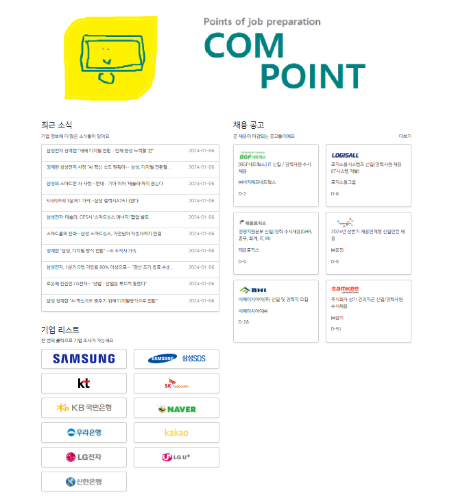
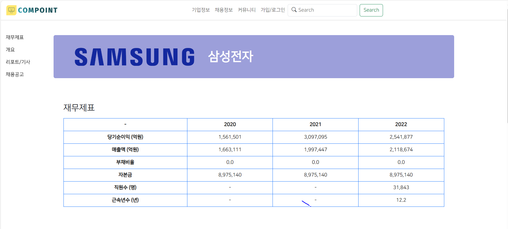
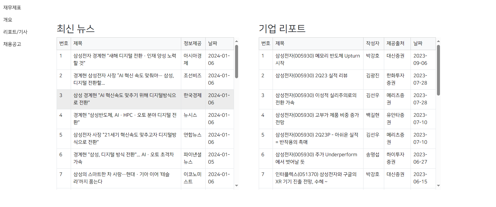
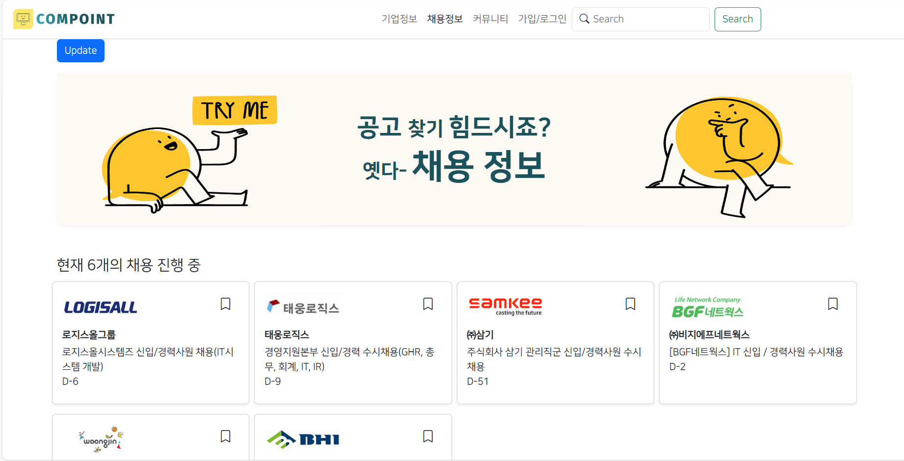
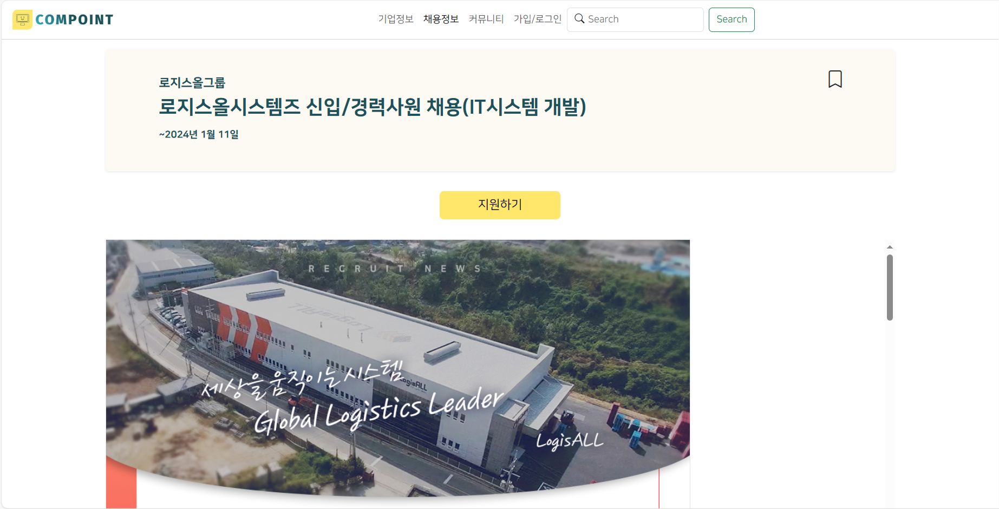
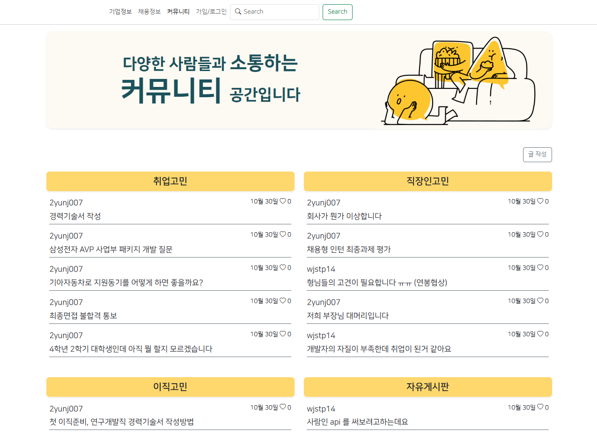

# Compoint

## :file_folder: 프로젝트 소개
 취준생과 이직자를 위한 기업 레포트, 채용 공고, 기업 기사 크롤링 사이트입니다.
 
***
## :computer: 개발 환경
      

***

##  :hourglass:  개발 기간
 2023.10.1 ~ 2023.10.30
***

## :smiley: 멤버 구성
|이름|기능|
|---|---|
**배정식**|재무제표 크롤링 , 커뮤니티 기능 구현, 풀스택|
**이윤정**|채용공고 크롤링 , 풀스택|
**전세진**|네이버 뉴스 및 기업 레포트 크롤링 , 풀스택|

***

## :exclamation: 페이지별 기능
1. 메인 페이지
{: width="100" height="100"}
1. 기업 정보
{: width="100" height="100"}
{: width="100" height="100"}
{: width="100" height="100"}
- 기업 뉴스 크롤링
  - 네이버 뉴스 크롤링. python의 requests 활용
- 기업 레포트 크롤링
  - 한경 컨센서스 크롤링. python의 requests 활용
1. 채용 공고
{: width="100" height="100"}
{: width="100" height="100"}
1. 커뮤니티
{: width="100" height="100"}
## 👨‍🚒: 새로운 버전에서 개선할 점 및 변경할 사항
- Rest API 구현
- Dajgno tempalte이 아닌 Frontend framework 별도 사용
- 성능 개선

